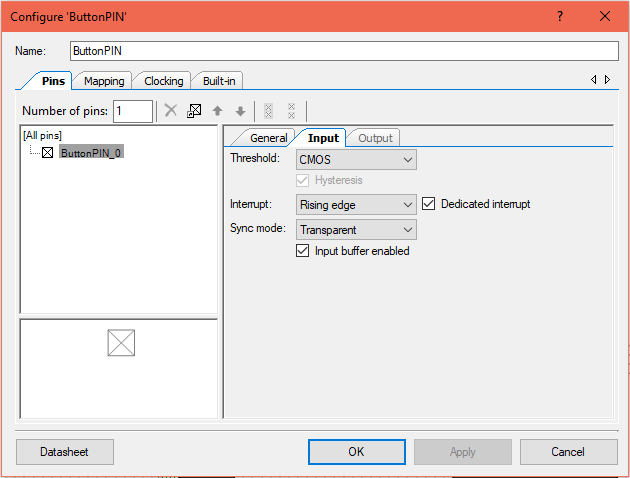
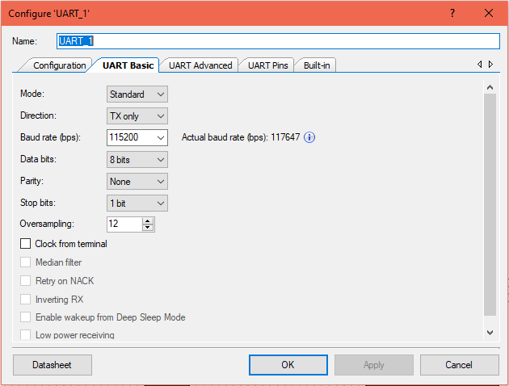
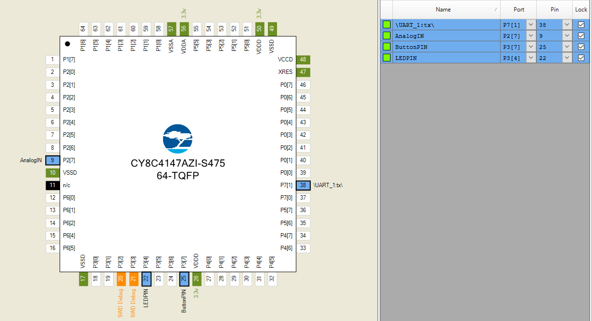

# ADC Streaming of GPIO Status

Stream ADC corresponding to the GPIO pin status. Perform the ADC conversion every 1sec (use PWM to generate the delay). Stream GPIO drive status.

# Creator Schematic


# Component Configurations

                                             PWM Settings: (Adapt according to input clock)


Toggle Button Interrupt settings: (Digital Input with no Hardware Connection, Rising(Or Falling) Edge Interrupt with Dedicated Interrupt)




SAR ADC Settings: (Set Vref to VDDA, Channels to 1, Mode of said channel to Single)


UART Config:



# Pin Configurations



# Firmware

```c
#include "project.h"

uint16_t result; 
uint8_t sendData[2];

CY_ISR (Delay_ISR_Handler){
ADC_SAR_Seq_1_StartConvert();
        if(ADC_SAR_Seq_1_IsEndConversion(ADC_SAR_Seq_1_WAIT_FOR_RESULT)==1)
        {
            result=ADC_SAR_Seq_1_GetResult16(0);          
        }
        
       sendData[0]=(result>>8) & 0x00FF;
       sendData[1]=(result) & 0x00FF;
        UART_1_UartPutChar(0xFF);
        UART_1_UartPutChar(0xAA);
        UART_1_UartPutChar(sendData[0]);
        UART_1_UartPutChar(sendData[1]);
        UART_1_UartPutChar(0xFF);
        UART_1_UartPutChar(0xFF);
        PWM_1_ClearInterrupt(PWM_1_INTR_MASK_TC);
}

int flag = 0;
CY_ISR( Pin_Switch_Handler )
{
    if(flag==0)
    {
        UART_1_Stop();
        flag=1;
    }
    else
    {
        UART_1_Start();
        flag=0;
    }
    LEDPIN_Write(~LEDPIN_Read());
    ButtonPIN_ClearInterrupt();
    
}

int main(void)
{
    
    CyGlobalIntEnable;
    isr_1_StartEx(Pin_Switch_Handler);
    
    UART_1_Start(); flag=0;
    ADC_SAR_Seq_1_Start();
    delayISR_StartEx(Delay_ISR_Handler);
    PWM_1_Start();

    for(;;){}
}
```

**— END**