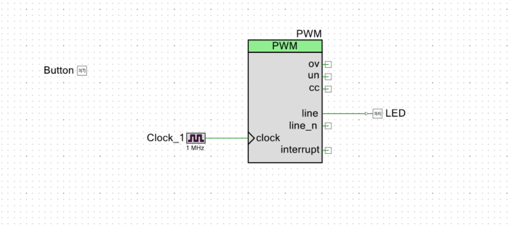
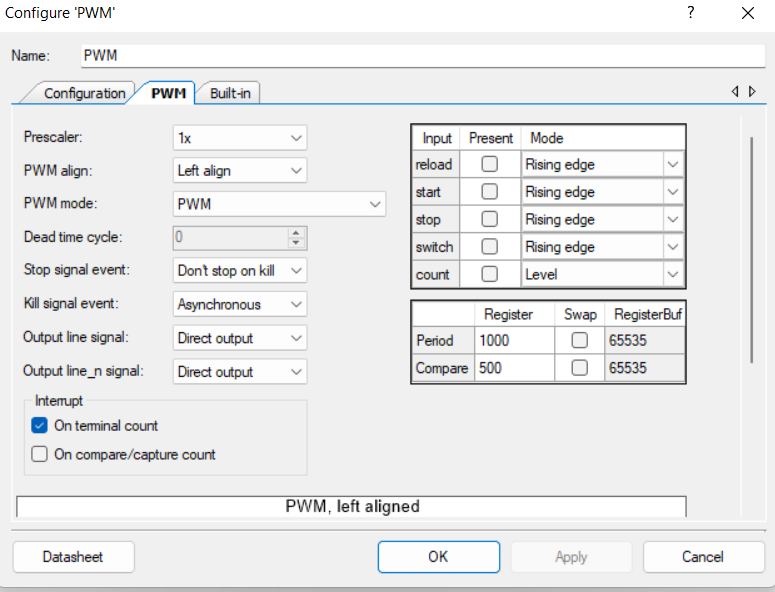

# LED brightness control with switch

> Increase the brightness of the LED by 10% every time a switch is pressed.
> 

# Creator Schematic



# Component Configurations

                                             



# Pin Configurations


# Firmware

```c
#include "project.h"

int main(void)
{
    CyGlobalIntEnable; /* Enable global interrupts. */
   
    //uint8_t stage1 = 1;
    //uint8_t stage2 = 1;
    
    int brightness = 0;
    int pressCount = 0;
    
    /* Set the PWM output to the LED. */
    PWM_Start();
    PWM_WriteCompare(brightness);

    for(;;)
    {
        //stage1 = Button_Read();
        //CyDelay(10);
        //stage2=Button_Read();
        
        //if (stage1 == 1 && stage2 ==0){
        
        /* Check if the button is pressed. */
            if (Button_Read() == 0) {
                /* Increase brightness. */
                brightness += 12;
                
                /* If brightness is at maximum, reset to 0. */
                if (brightness > 255) {
                    brightness = 0;
                    /* Increment press count. */
                    pressCount++;
                }
                
                /* If we've pressed the button three times, turn off LED and reset count. */
                if (pressCount >= 10) {
                    PWM_Stop();
                    CyDelay(500);
                    PWM_Start();
                    pressCount = 0;
                }
                
                /* Update the LED brightness. */
                PWM_WriteCompare(brightness);
                
                /* Delay for debouncing. */
                CyDelay(100);
         //   }
        }
    }
}
```

**— END**