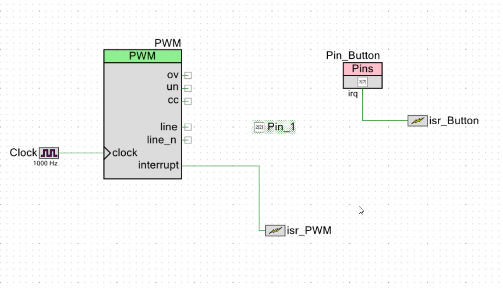
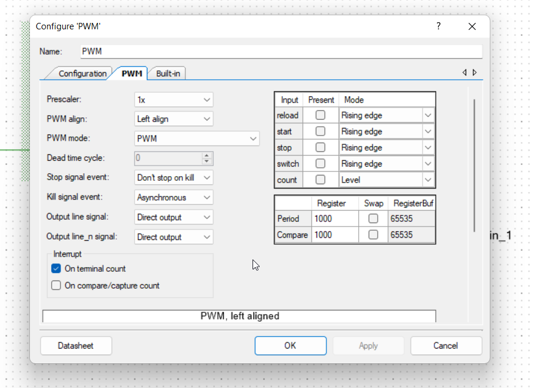
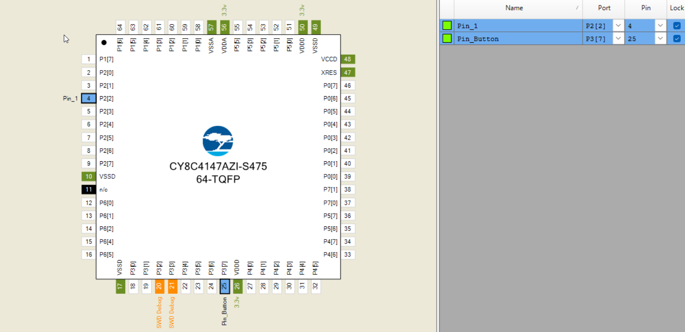

# LED control with double tap

Turn ON an LED if a button is pressed two times within an interval of 1 seconds.

# Creator Schematic



# Component Configurations

                                             



# Pin Configurations



# Firmware

```c
#include "project.h"

uint32_t flag = 0;

CY_ISR(button_isr_handler)
{
    if (flag == 1){
        Pin_1_Write(0);
        PWM_Stop();
    }
    if (flag == 0){
        flag = 1;
        PWM_Start();
    }
    
    Pin_Button_ClearInterrupt(); /* Clear button interrupt */
}

CY_ISR(pwm_isr_handler)
{
    flag = 0;
    PWM_Stop();
    PWM_ClearInterrupt(PWM_INTR_MASK_TC); /* Clear PWM interrupt */
}

int main(void)
{
    CyGlobalIntEnable; /* Enable global interrupts. */

    /* Place your initialization/startup code here (e.g. MyInst_Start()) */
    
    isr_Button_StartEx(button_isr_handler);
    isr_Button_ClearPending();
    
    isr_PWM_StartEx(pwm_isr_handler);
    isr_PWM_ClearPending();
    
    Pin_1_Write(1);
    
    for(;;)
    {
        /* Place your application code here. */
    }
}

/* [] END OF FILE */
```

**— END**