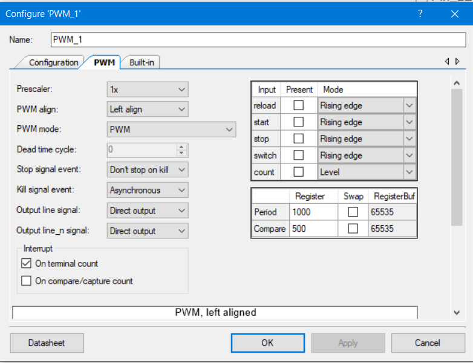

# Turn ON LED in Sequence

Turn ON LED-1, LED-2 and LED-3 after 1s, 5s and 10sec. Use a PWM to generate the delay. 

# Creator Schematic


# Component Configurations

                                             




# Pin Configurations


# Firmware

```c
/* ========================================
 *
 * Copyright YOUR COMPANY, THE YEAR
 * All Rights Reserved
 * UNPUBLISHED, LICENSED SOFTWARE.
 *
 * CONFIDENTIAL AND PROPRIETARY INFORMATION
 * WHICH IS THE PROPERTY OF your company.
 *
 * ========================================
*/
#include "project.h"
uint8_t i=0;
CY_ISR (my_isr)
{
    if(i==1)
    {
        Pin_LED1_Write(0);        
        PWM_1_Stop();
    }
    

    if(i==5)
    {
        Pin_LED2_Write(0);        
        PWM_1_Stop();
    }
    if(i==10)
    {
        Pin_LED3_Write(0);        
        PWM_1_Stop();
    }
         i++;   
         PWM_1_WritePeriod(i*1000);
         PWM_1_Start();
      
} 
   

int main(void)
{
    CyGlobalIntEnable; /* Enable global interrupts. */

    /* Place your initialization/startup code here (e.g. MyInst_Start()) */

    //Pin_LED1_Write(1);
    PWM_1_Start();
     Pin_LED1_Write(1);
     Pin_LED2_Write(1);
     Pin_LED3_Write(1);
    isr_1_StartEx(my_isr);
    
  
    for(;;)
    {
        /* Place your application code here. */
    }
}
```

**— END**