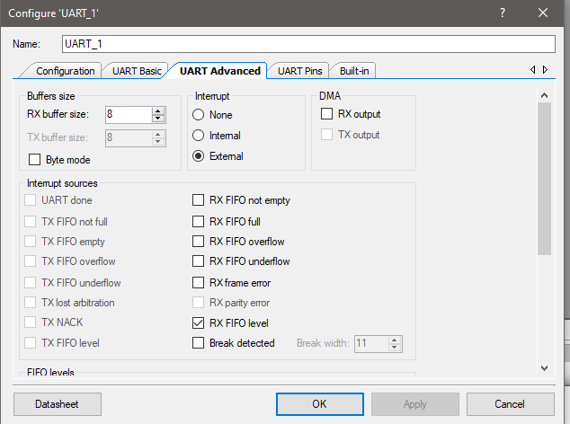
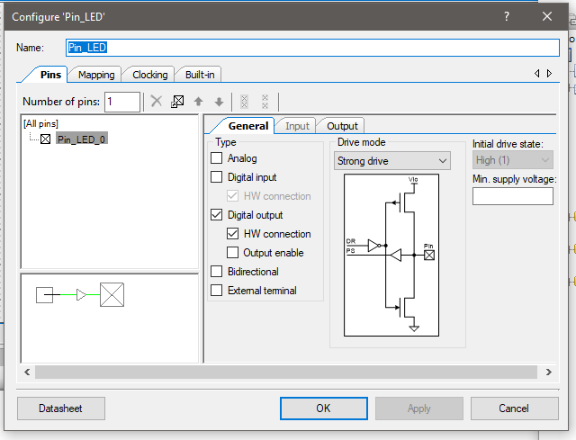

# UART-based PWM configuration

> Control the PWM frequency and duty-cycle via UART. Freeze the PWM control upon pressing a GPIO switch.
> 

# Schematic

                                                                                                                                







# Firmware (PSoC)

```c
#include "project.h"

CY_ISR(my_isr)
{  // CyDelay(100);
    uint8_t var,var2;
    var = UART_1_UartGetByte();
    var2= UART_1_UartGetByte();
   PWM_1_WritePeriod(var);
PWM_1_WriteCompare(var2);

    
   
// Clear the interrupt
    UART_1_SpiUartClearRxBuffer();
    UART_1_ClearRxInterruptSource(UART_1_INTR_RX_ALL);
}
int main(void)
{
    CyGlobalIntEnable; /* Enable global interrupts. */
PWM_1_Start();
    /* Place your initialization/startup code here (e.g. MyInst_Start()) */
    UART_1_Start();
    /* Link to ISR */
    isr_1_StartEx(my_isr);

    for(;;)
    {
        /* Place your application code here. */
    }
}
##
Firmware (Python)

```

# Firmware (Python)

```python
import serial
import time

serialPort= serial.Serial('COM8', baudrate=115200, parity=serial.PARITY_NONE, stopbits=serial.STOPBITS_ONE)

   
serialPort.write(b'\x0A')

serialPort.write(b'\x05')
    
serialPort.close()
```

**— END**