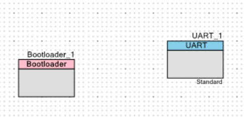
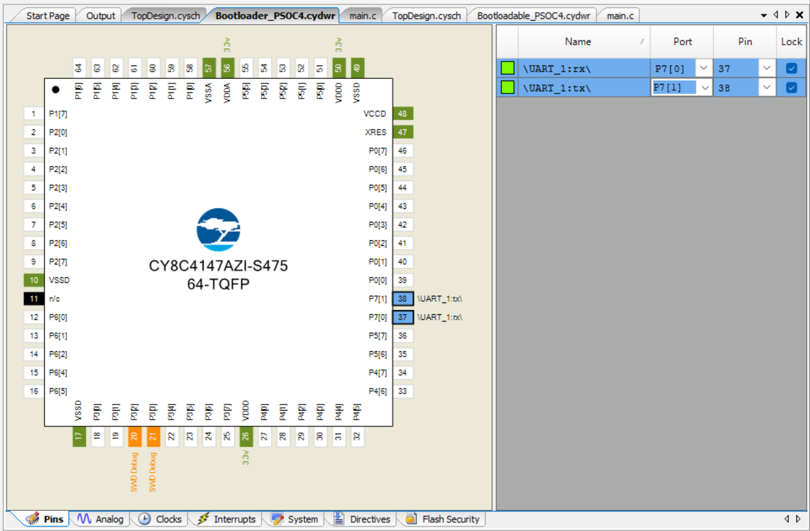
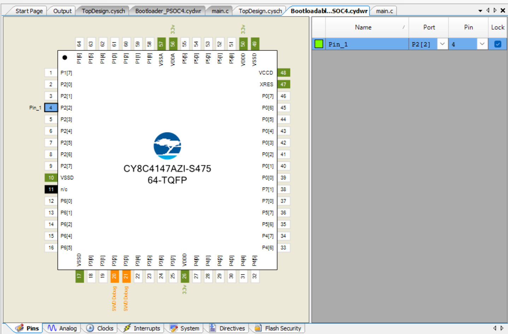

# UART-based bootloader

> UART bootloader and bootloadable projects with PSoC-4
> 

# Schematic (Bootloader)






# Schematic (Bootloadable)




# Firmware (Bootloader)

```c
#include "project.h"

int main(void)
{
    CyGlobalIntEnable; /* Enable global interrupts. */
    Bootloader_1_Start();

    /* Place your initialization/startup code here (e.g. MyInst_Start()) */

    for(;;)
    {
        /* Place your application code here. */
    }
}

/* [] END OF FILE */
```

# Firmware (Bootloadable)

```c
#include "project.h"

int main(void)
{
    CyGlobalIntEnable; /* Enable global interrupts. */
    PWM_1_Start();

    /* Place your initialization/startup code here (e.g. MyInst_Start()) */

    for(;;)
    {
        /* Place your application code here. */
    }
}

/* [] END OF FILE */
```

# Bootloading Method

Build and Program Bootloader project. This creates a bootloader program in PSOC-4. Then build the bootloadable project and program it by using bootloader host. 


**— END**